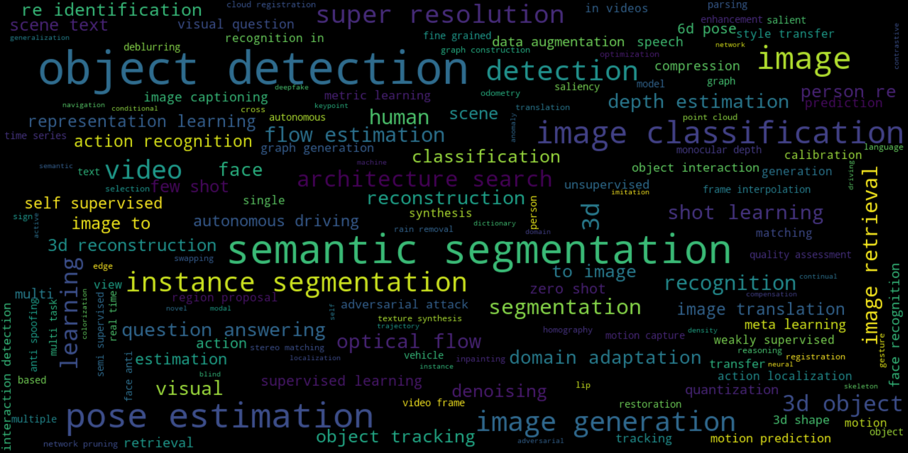

# CVPR-2020-Paper-Code-Statistics
Crawl CVPR paper and code, make statistical visualization of topic and keyword


## Quick Start

1. Download CVPR papers:

   >  download_cvpr_pdfs.ipynb
   
   or
   
   > python download_cvpr_pdfs.py
   
2. Crawl the github code url, stars, topics from [paperswithcode](```https://paperswithcode.com/```)

   > cvpr_paper_code_statistics.ipynb

   or

   > python cvpr_paper_code_statistics.py

## Information

In CVPR2020, we find 581 papers with available code through [paperswithcode](```https://paperswithcode.com/```). We analysis these papers and get following information.

### Topics

Count topics of each paper with code

|      | topic                   | count |
| ---- | ----------------------- | ----- |
| 8    |                         | 3443  |
| 0    | object-detection        | 57    |
| 2    | semantic-segmentation   | 49    |
| 3    | image-classification    | 32    |
| 4    | image-generation        | 26    |
| 83   | pose-estimation         | 25    |
| 5    | instance-segmentation   | 22    |
| 61   | architecture-search     | 20    |
| 57   | optical-flow-estimation | 17    |
| 1    | image-retrieval         | 16    |
| 33   | super-resolution        | 14    |


### Wordcloud of topics



### Paper information 

**Include title, author, topics, github url, code stars, etc.**

|      | title                                                        | author             | task 1                | task 2              | task 3           | github                                                       | stars |
| ---- | ------------------------------------------------------------ | ------------------ | --------------------- | ------------------- | ---------------- | ------------------------------------------------------------ | ----- |
| 1    | Context R-CNN: Long Term Temporal Context for Per-Camera Object Detection | Sara Beery         | object-detection      | video-understanding |                  | https://github.com/tensorflow/models/tree/master/research/object_detection | 64576 |
| 2    | MnasFPN: Learning Latency-Aware Pyramid Architecture for Object Detection on Mobile Devices | Bo Chen            | object-detection      |                     |                  | https://github.com/tensorflow/models/tree/master/research/object_detection | 64576 |
| 3    | Google Landmarks Dataset v2 - A Large-Scale Benchmark for Instance-Level Recognition and Retrieval | Tobias Weyand      | image-retrieval       | transfer-learning   |                  | https://github.com/tensorflow/models/tree/master/research/delf | 64576 |
| 4    | PointRend: Image Segmentation As Rendering                   | Alexander Kirillov | semantic-segmentation |                     |                  | https://github.com/facebookresearch/detectron2/tree/master/projects/PointRend | 11147 |
| 5    | Distilling Effective Supervision From Severe Label Noise     | Zizhao Zhang       | image-classification  |                     |                  | https://github.com/google-research/google-research/tree/master/ieg | 10588 |
| 6    | Bridging the Gap Between Anchor-Based and Anchor-Free Detection via Adaptive Training Sample Selection | Shifeng Zhang      | object-detection      |                     |                  | https://github.com/open-mmlab/mmdetection                    | 10263 |
| 7    | Analyzing and Improving the Image Quality of StyleGAN        | Tero Karras        | image-generation      |                     |                  | https://github.com/NVlabs/stylegan2                          | 4713  |
| 8    | SpineNet: Learning Scale-Permuted Backbone for Recognition and Localization | Xianzhi Du         | instance-segmentation | architecture-search | object-detection | https://github.com/tensorflow/tpu/tree/master/models/official/detection | 3585  |


### Search papers using topic or keyword

**Input:**

> pull_papers(df, 'denoising')

**Output:**

|      | title                                             | author                | task 1             | task 2              | task 3                   | github                                            | stars |
| ---- | ------------------------------------------------- | --------------------- | ------------------ | ------------------- | ------------------------ | ------------------------------------------------- | ----- |
| 127  | FastDVDnet: Towards Real-Time Deep Video Denoi... | Matias Tassano        | denoising          | motion-compensation | motion-estimation        | https://github.com/m-tassano/fastdvdnet           | 102   |
| 172  | A Physics-Based Noise Formation Model for Extr... | Kaixuan Wei           | denoising          | image-denoising     |                          | https://github.com/Vandermode/NoiseModel          | 75    |
| 238  | Supervised Raw Video Denoising With a Benchmar... | Huanjing Yue          | denoising          | image-denoising     | video-denoising          | https://github.com/cao-cong/RViDeNet              | 49    |
| 339  | Transfer Learning From Synthetic to Real-Noise... | Yoonsik Kim           | denoising          | transfer-learning   |                          | https://github.com/terryoo/AINDNet                | 25    |
| 684  | Event Probability Mask (EPM) and Event Denoisi... | R. Wes Baldwin        |                    |                     |                          |                                                   |       |
| 693  | Self2Self With Dropout: Learning Self-Supervis... | Yuhui Quan            |                    |                     |                          |                                                   |       |
| 721  | Joint Demosaicing and Denoising With Self Guid... | Lin Liu               |                    |                     |                          |                                                   |       |
| 804  | Memory-Efficient Hierarchical Neural Architect... | Haokui Zhang          |                    |                     |                          |                                                   |       |
| 1285 | Basis Prediction Networks for Effective Burst ... | Zhihao Xia            |                    |                     |                          |                                                   |       |
| 130  | CycleISP: Real Image Restoration via Improved ... | Syed Waqas Zamir      | denoising          | image-denoising     | image-restoration        | https://github.com/swz30/CycleISP                 | 98    |
| 270  | Show, Edit and Tell: A Framework for Editing I... | Fawaz Sammani         | denoising          | image-captioning    |                          | https://github.com/fawazsammani/show-edit-tell    | 40    |
| 434  | Plug-and-Play Algorithms for Large-Scale Snaps... | Xin Yuan              | denoising          |                     |                          | https://github.com/liuyang12/PnP-SCI              | 11    |
| 492  | Enhancing Intrinsic Adversarial Robustness via... | Guanlin Li            | denoising          | image-restoration   | self-supervised-learning | https://github.com/GuanlinLee/FPD-for-Adversar... | 6     |
| 93   | Rethinking Data Augmentation for Image Super-r... | Jaejun Yoo            | data-augmentation  | denoising           | image-restoration        | https://github.com/clovaai/cutblur                | 157   |
| 511  | ColorFool: Semantic Adversarial Colorization      | Ali Shahin Shamsabadi | adversarial-attack | colorization        | denoising                | https://github.com/smartcameras/ColorFool         | 4     |


## TODO

- [ ] Crawl citation rate for each paper.


## Reference

1. https://paperswithcode.com/
2. https://github.com/priya-dwivedi/Deep-Learning/tree/master/cvpr2019
3. https://github.com/guanfuchen/cvpr_review
4. https://github.com/jonahthelion/cvpr_with_code
5. https://github.com/hoya012/CVPR-2019-Paper-Statistics